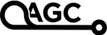
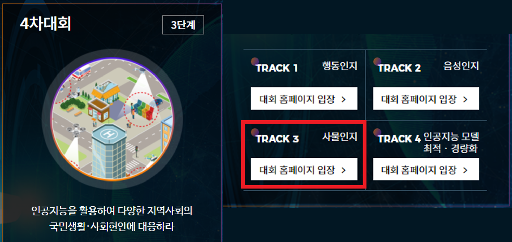
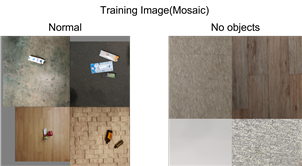
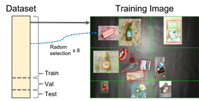

# AGC2021_object-detection
  
**[2021 AI Grand Challenge](https://www.ai-challenge.or.kr/) (Nov 10, 2021 ~ Nov 14, 2021)**  
- Object Detection Track  



## <div align="center">History</div>
> **[AI Grand Challenge](http://www.ai-challenge.kr) (Nov 16, 2020  ~ Nov 20,2020)**  
**🥈 2nd Place Winner** of Object Detection Track  
>- Based on [mmdetection](https://github.com/open-mmlab/mmdetection), Cascade R-CNN
>- Github : [https://github.com/jaebbb/Recycle-Trash-Detection](https://github.com/jaebbb/Recycle-Trash-Detection)

> **Follow-up study (Jan, 2021 ~ Dec, 2021)**  
>- Implementation of recyclable trash object detection model based on **YOLOv5**
>- Quantization, Pruning for embedded system
>- A total of **130,000** training image datasets
>- Final macro F1 score is **0.9** (mAP@.5 : 0.94)


## <div align="center">Environments</div>
```
Ubuntu 18.04   
CUDA 11.1.1
Python 3.8.3
```
Our object detection model is implemented in [YOLOv5](https://github.com/ultralytics/yolov5).


## <div align="center">Key points</div>
### 1. Bbox Cutmix 
There were No-object images in training when using ***mosaic*** because of image center position of objects. So we implemented a augmentation pasting bboxes in the empty space of a training image(***Bbox Cumtix***).
<div align="center">

<p>An example of bbox cutmix</p>
</div>

```python
if self.crop_aug :
    img , labels = self.selfmix(img, labels, h, w)

...

def selfmix(self, img, labels, h, w):
    # get a bbox from a rand-selected img
    # augmentation for bbox
    # get coordinates from a training img to paste a bbox
        # resize a bbox(optional)
    # get a training img with a new bbox
    return img, labels
```

### 2. TTA
In addition, ***TTA*** was used to improve performance. ***TTA*** was implemented based on [ODAch](https://github.com/kentaroy47/ODA-Object-Detection-ttA), an object detection-based tool.

1) Add a `wrap_yolov5` for YOLOv5
```python
class wrap_yolov5:
    def __init__(self, model_list, nms):
        # imsize.. input size of the model
        self.model_list = model_list
        self.nms = nms

    def __call__(
        self, img, conf_thres=0.2, iou_thres=0.6, agnostic_nms=False, multi_label=True, max_det=140
    ):
        # inference
        batch = None
        for model in self.model_list:
            if batch is None:
                batch = model(img)[0]
            else:
                batch += model(img)[0]
        batch /= len(self.model_list)

        batch = self.nms(batch, conf_thres, iou_thres, None, agnostic_nms,
                         multi_label=multi_label, max_det=max_det)

        predictions = []
        for pred in batch:
            predictions.append({"boxes": pred[:, :4], "scores": pred[:, 4], "labels": pred[:, 5]})

        return predictions
```
2) Use more ***TTA*** variation
```python
TTA_AUG_LIST = [
    oda.Rotate90Left(),
    oda.Rotate90Right(),
    oda.HorizontalFlip(),
    oda.VerticalFlip(),
    oda.RandColorJitter(),
    oda.TorchBlur(),
    oda.TorchMedianBlur(),
]
```
